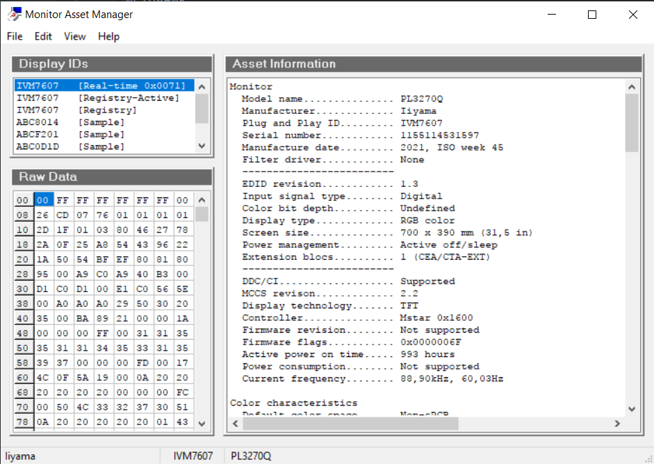

источник:
пост Mihas'а [link](https://cielab.xyz/forum/viewtopic.php?t=649)

Краткий пересказ:

### Скачиваем утилиту Moninfo

[Ссылка](https://www.entechtaiwan.com/util/moninfo.shtm)

### Находим координаты опорных цветов монитора

В ПЗУ монитора производитель прописывает координаты опорных цветов R, G и B.
Обычно это довольно точные цифры.

### Заносим значения в калькулятор

[Locus of area CIE xy • Охват монитора](https://cielab.xyz/xylocus.php)

Заносим шесть значеий `x` и `y` координат в калькулятор, нажимаем кнопку `Calc`,
получаем треугольник цветового охвата. 

Имеес смысл сравнивать с целевыми охватами sRGB и Adobe RGB. Любой пригодный для работы монитор должен иметь полный охват sRGB,
а профессиональный - стремиться к полному охвату Adobe RGB.

