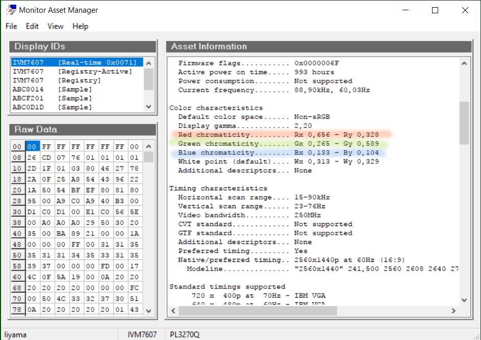

источник:
пост Mihas'а [link](https://cielab.xyz/forum/viewtopic.php?t=649)

Краткий пересказ:

### Скачиваем утилиту Moninfo

[Ссылка](https://www.entechtaiwan.com/util/moninfo.shtm)

### Находим координаты опорных цветов монитора

В ПЗУ монитора производитель прописывает координаты опорных цветов R, G и B.
Обычно это довольно точные цифры.

